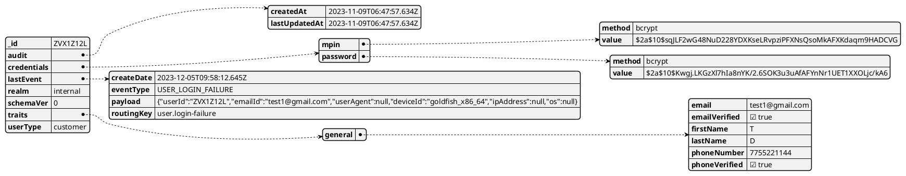

# Collections

## users

users collection stores user profile details like user id, user credential, audi, traits etc.

### example

```json
 {
  "_id": "ZVX1Z12L",
  "audit": {
    "createdAt": "2023-11-09T06:47:57.634Z",
    "lastUpdatedAt": "2023-11-09T06:47:57.634Z"
  },
  "credentials": {
    "mpin": {
      "method": "bcrypt",
      "value": "$2a$10$sqJLF2wG48NuD228YDXKseLRvpziPFXNsQsoMkAFXKdaqm9HADCVG"
    },
    "password": {
      "method": "bcrypt",
      "value": "$2a$10$Kwgj.LKGzXl7hIa8nYK/2.6SOK3u3uAfAFYnNr1UET1XXOLjc/kA6"
    }
  },
  "lastEvent": {
    "createDate": "2023-12-05T09:58:12.645Z",
    "eventType": "USER_LOGIN_FAILURE",
    "payload": "{\"userId\":\"ZVX1Z12L\",\"emailId\":\"test1@gmail.com\",\"userAgent\":null,\"deviceId\":\"goldfish_x86_64\",\"ipAddress\":null,\"os\":null}",
    "routingKey": "user.login-failure"
  },
  "realm": "internal",
  "schemaVer": 0,
  "traits": {
    "general": {
      "email": "test1@gmail.com",
      "emailVerified": true,
      "firstName": "T",
      "lastName": "D",
      "phoneNumber": "7755221144",
      "phoneVerified": true
    }
  },
  "userType": "customer"
}
```

### visual



### dictionary

field | description | characteristics | example 
-----|------------|----------------|--------------------------
_id  | the identifier of the user | ObjectID | QC7G-Q47E-EFWU 
audit | Audit fields | Object  | holding object
audit.createdAt | when was this document created | Object  | Object
audit.lastUpdated | when was this document last updated | Object | Object
credentials | credentials of users | Object | Object
credentials.mpin | mpin of users | Object | Object
credentials.mpin.method | encryption method | String | "bcrypt"
credentials.mpin.value | encrypted mpin value | String | "$2a$10$sqJLF2wG48NuD228YDXKseLRvpziPFXNsQsoMkAFXKdaqm9HADCVG"
credentials.password | stored password | Object | Object
credentials.password.method | encryption method | "bcrypt"
credentials.password.value | encrypted password value | "$2a$10$Kwgj.LKGzXl7hIa8nYK/2.6SOK3u3uAfAFYnNr1UET1XXOLjc/kA6"
lastEvent | when last even occur | Object | Object
lastEvent.createDate | when user created | Date | "2023-12-05T09:58:12.645Z"
lastEvent.eventType | what is last event | String | "USER_LOGIN_FAILURE"
lastEvent.payload | what was the payload | String | "{\"userId\":\"ZVX1Z12L\",\"emailId\":\"test1@gmail.com\",\"userAgent\":null,\"deviceId\":\"goldfish_x86_64\",\"ipAddress\":null,\"os\":null}"
lastEvent.routingKey | routing key for messaging | String | "user.login-failure"
realm | realm of user | String | "internal"
schemaVer | schema version of collection | Int32 | 0
traits | user traits | Object | Object
traits.general | general traits | Object | Object
traits.general.email | email of user | String | "test1@gmail.com"
traits.general.emailVerified | if email verified | boolean | true
traits.general.firstName | first name of user | String | "Haris"
traits.general.lastName | last name of user | String | "Faiz"
traits.general.phoneNumber | phone number | String | "7755221144"
traits.general.phoneVerified | if phone verified | boolean | true
traits.general.address | user address | Object | Object
traits.general.address.addressLine1 | address line 1 | String | Gachibowli
traits.general.address.addressLine2 | address line 2 | String | String
traits.general.address.city | city | String | Hyderabad
traits.general.address.state | state | String | Telangana
traits.general.address.pinCode | pin code | String | 500001
traits.general.address.country | country | String | India
traits.general.dateOfBirth | date of birth | Date | 2002-12-05
traits.customer | customer traits | Object | Object
traits.customer.pan | pan | String | ACMP9837D
traits.customer.membershipPlan | membership plan | String | GOLD
traits.customer.kyc | kyc | Object | Object
traits.customer.kyc.status | kyc status | String | String
traits.customer.kyc.statusCode | status code | String | String 
traits.customer.kyc.lastVerified | last verified | long | 2023-12-05
traits.customer.kyc.claims | kyc claims | Object | Object
auth | auth info | Object | Object
auth.status | auth status | String | String  
auth.lastLoginAt | last login | long | long
auth.failedLogins | failed logins | int | 2