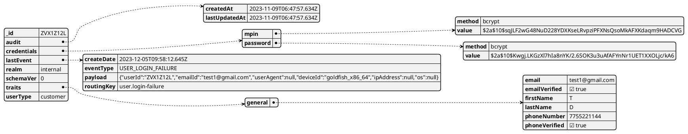

#Collections

## users

Users collection stores all aspects of a Fintrust user including credentials, role etc.

### example

```json
 {
  "_id": "ZVX1Z12L",
  "audit": {
    "createdAt": "2023-11-09T06:47:57.634Z",
    "lastUpdatedAt": "2023-11-09T06:47:57.634Z"
  },
  "credentials": {
    "mpin": {
      "method": "bcrypt",
      "value": "$2a$10$sqJLF2wG48NuD228YDXKseLRvpziPFXNsQsoMkAFXKdaqm9HADCVG"
    },
    "password": {
      "method": "bcrypt",
      "value": "$2a$10$Kwgj.LKGzXl7hIa8nYK/2.6SOK3u3uAfAFYnNr1UET1XXOLjc/kA6"
    }
  },
  "lastEvent": {
    "createDate": "2023-12-05T09:58:12.645Z",
    "eventType": "USER_LOGIN_FAILURE",
    "payload": "{\"userId\":\"ZVX1Z12L\",\"emailId\":\"test1@gmail.com\",\"userAgent\":null,\"deviceId\":\"goldfish_x86_64\",\"ipAddress\":null,\"os\":null}",
    "routingKey": "user.login-failure"
  },
  "realm": "internal",
  "schemaVer": 0,
  "traits": {
    "general": {
      "email": "test1@gmail.com",
      "emailVerified": true,
      "firstName": "T",
      "lastName": "D",
      "phoneNumber": "7755221144",
      "phoneVerified": true
    }
  },
  "userType": "customer"
}
```

### visual



### dictionary


field| description| characteristics| example
-----|------------|----------------|-------
_id  | the identifier of the user | ObjectID | fhgj7-587657-gfghf8-r67
