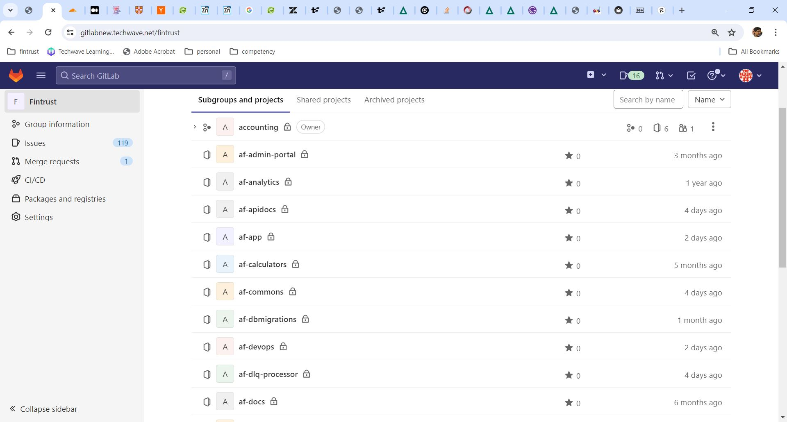
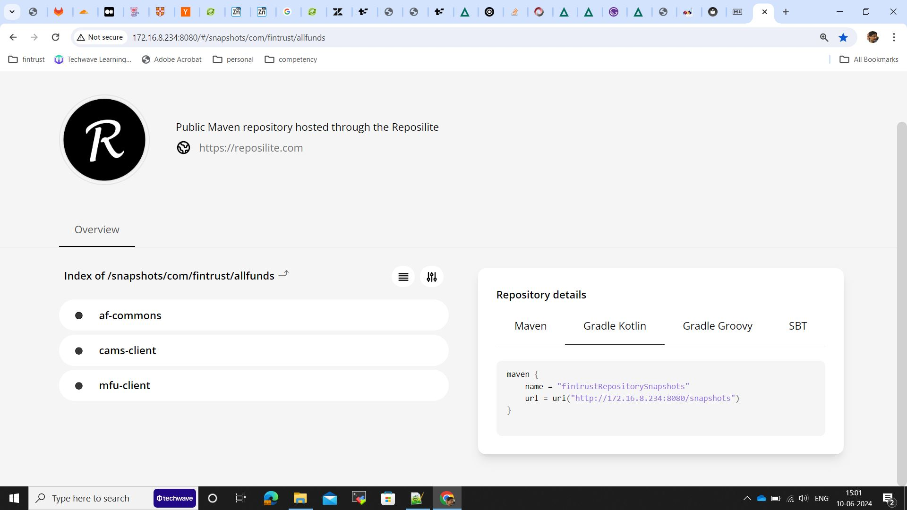
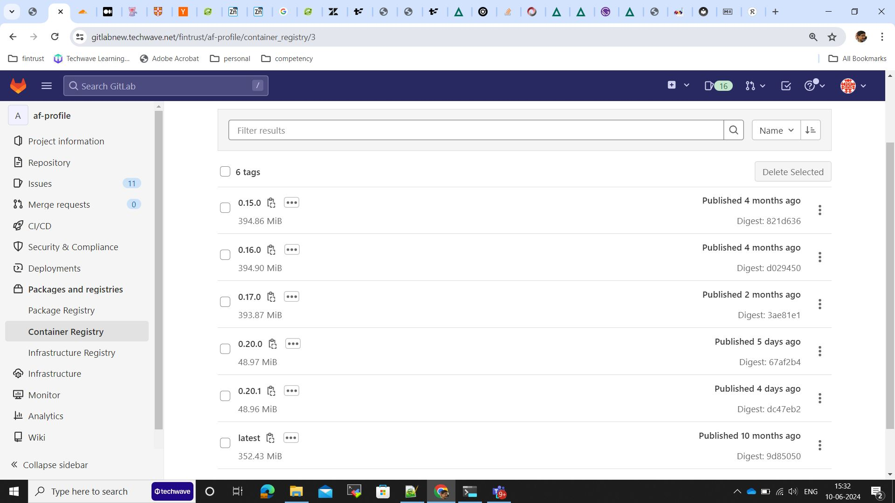
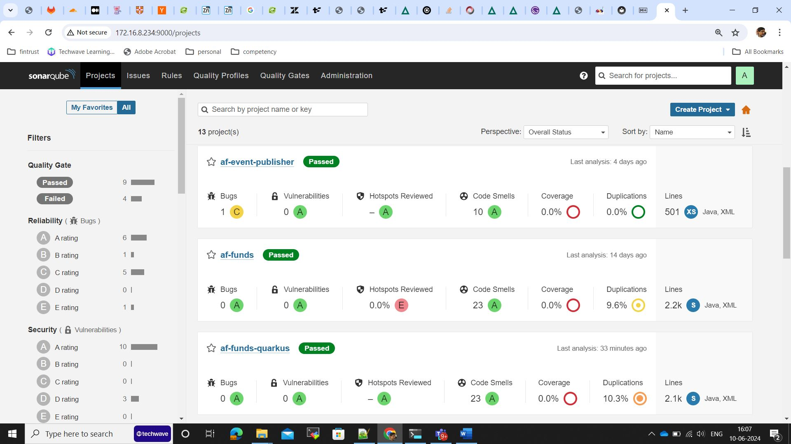
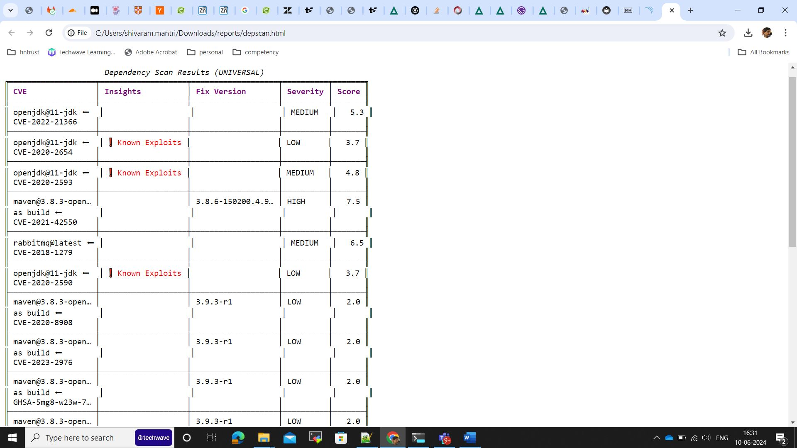

# Principles and Practices

## Core Ethos

The core ethos that underpin all software engineering practices in the system are

### Everything as Code
[What is everything as code?](https://docs.aws.amazon.com/wellarchitected/latest/devops-guidance/everything-as-code.html)

Every aspect of the system - such as software, migrations, build pipelines, tests, infrastructure, documentation , even diagrams as modeled in Code. This ensures they can be effectively stored, versioned and deployed in a repeatable fashion with very little manual support.

### Everything is a Container
Everything that we deliver in this project is a docker container. Nothing in the system requires a manual setup. This ensures very high portability of the components as they move across environments. Containers include developed software, migrations, tests, dependency software, quality assessment tools, wikis and documentation. They can be easily turned on/off for deployment across environments.

### Everything is Stored
Everything in the project has a home – a repository. This includes source code, docker containers, libraries, deployment packages (such as helm-charts)

## Configuration Management Principles

### Code Repositories

 - All source code is managed in GitLab. 
 - Each unique software function is maintained in a dedicated GitLab repository.
 - Each repository is connected to a build pipeline
 - Each build pipeline results in an artifact.
 - Each artifact is stored in a repository.

### Artifact Repositories

All artifacts are housed in dedicated repositories.

#### Reposilite

Libraries are stored in Reposilite (like Artifactory or Nexus but free and open source)

#### Docker Container Registry

Containers are stored in GitLab Container Registries

 
### Versioning
All versions follow a major.minor.fix scheme.

#### During development
During development we follow Sprint-versioning scheme. All components are re-versioned at the start of the sprint. 
Given a version number MAJOR.MINOR.PATCH, increment the:
MAJOR version  is always 0
MINOR version is the version of the sprint.
PATCH version is incremented for every additional release made within the sprint

#### Post go-live
Post go-live all components will follow a Semantic versioning scheme.
The Semver standard is fully described here - https://semver.org/
Given a version number MAJOR.MINOR.PATCH, increment the:
MAJOR version when you make incompatible API changes
MINOR version when you add functionality in a backward compatible manner
PATCH version when you make backward compatible bug fixes
Additional labels for pre-release and build metadata are available as extensions to the MAJOR.MINOR.PATCH format.

### Continuous Integration

> To be done

### Continuous Deployments

> To be done

## Build Principles

### SAST and DAST

We use SonarQube for static and dynamic code analysis and security scans. All build pipelines are integrated to Sonar and capture quality on a continuous basis. We strive to ensure A grade on all parameters such a Reliability, Security, Maintainabilty, Duplications etc.

### Software dependency analysis
The below article describes the need for software dependency analysis as a key driver for building high quality software
[What are software dependencies?](https://www.sonatype.com/resources/articles/what-are-software-dependencies)
We are implementing OWASP’s Dependency Scan to assess CVEs and Licensing challenges pertaining to use of 3rd party software. 
[OWASP DepScan tool](https://owasp.org/www-project-dep-scan/)

According to OWASP,  “dep-scan is a next-generation security and risk audit tool based on known vulnerabilities, advisories, and license limitations for project dependencies. Both local repositories and container images are supported as the input, and the tool is ideal for integration with ASPM/VM platforms and in CI environments”.

See below an integration of DepScan into our CI process

See below an extract of vulnerabilities identified by DepScan

### Environments

We support a multi-environment system. The design of the environments is such that the lower environments are flexible to the needs of a developer. The higher environments are increasingly closer to the final production environment. The important principle is that all code created and tested in the lower environments are guaranteed to work on the higher environments. To achieve this we run multiple flavors of Kubernetes on these environments.

Environment	| Stack Used
------------|------------
Local	    | Docker Desktop Commercial Edition on Windows 10/11 running docker engine and Kubernetes
Automation  | Kubernetes running on Minikube and Docker engine running on Ubuntu 22.04 Linux
Integration | Kubernetes running on Minikube and Docker engine running on Ubuntu 22.04 Linux
Staging	    | AWS Elastic Kubernetes Service (EKS) – managed Kubernetes service
Production 	| AWS Elastic Kubernetes Service (EKS) – managed Kubernetes service

### Unit Tests
Unit tests are generally discarded in favor of integration tests for end-to-end verification. However, Unit tests are developed for all libraries and any code that uses a lot of logic.
We are exploring the use of GitHub CoPilot to automatically generate Unit tests to optimize time spent by developers on this activity.

### Integration Tests
We have a robust automation test suite that tests all APIs developed. The automation suite is built on Karate and supports the ability to invoke tests and also the ability to Mock 3rd party APIs and Services that cannot be tested in a repeatable fashion.
The automation tests are run on a dedicated environment that is recreated on every run with all migrations (db, mq, etc.) applied. This guarantees that the tests are repeatable.
The automation tests are as part of the Continuous Delivery pipeline that packages all software and promotes it to higher environments such as Dev (integration). Unless the tests pass, the software is not promoted.
 

The tests are run as explained below.
 

A sample results of the test is shown below.
 

### Performance Tests

> To be done

### Vulnerability and Penetration Tests

> To be done

### Packaging and Deployment

 - The applications are packaged as one or more helm charts
 - The helm charts are stored in the GitLab Package registry.
 - The packaging and promotion are done as part of the Continuous Delivery pipeline
 - Configuration and Secrets for various environments are overridden and injected externally.

 

##	Infrastructure Principles

### Infrastructure as Code

We use IaC (Infrastructure as Code) practices to patch and re-create infrastructure on demand. 
 - OpenTofu (open source fork of Terraform) is used to build the infra.
 - Generates everything from Bastion, VPC, Networking, Load Balancers, Kubernetes, Databases, Nodepools, Secrets, Observability engines etc.

## Run Principles

### Migrations

 - Database changes are captures as Migrations (up and down) and are automatically applied on promotions.
 - RabbitMQ state (exchanges, queues, bindings) are captured as migrations and are automatically applied on promotions,
 - We use Kubernetes init-container strategies to prioritize execution of migration containers and wait for them to finish before deploying application components.

### Observability

 - All containers generate logs
 - Logs are formatted as JSON
 - Logs are streamed to STDOUT and STDERR
 - FluentBit is run as a daemonset to trap logs and forward to OpenObserve
 - Logs can filtered, analyzed and archived in OpenObserve

 

### Secrets Management

Environment | Secrets
------------|--------
Local	    | Helm overrides (values.yaml)
Dev	        | Helm overrides (values.yaml)
Automation	| Helm overrides (values.yaml)
Staging	    | Secrets managed in AWS Secrets Manager are injected into AWS EKS using ESO https://external-secrets.io/latest/

## Documentation Principles

### Development Aids
To fast-track a new developer into understanding how to build and deploy a component, we provide Readme’s.  See below an example Readme for a component named MQ-Migrations.
 
### API Docs

All internal and external APIs are fully documented using OpenAPI 3.0 specifications. The requests and responses are fully documented to eliminate any source of confusion. These are used as the ONLY source of information by the UI and QA teams to either integrate into these APIs or perform Quality Assurance on these APIs. In tune with the ethos of the platform, which is to containerize everything, even the API documentation is also built using pipelines and deployed on k8s environments as another container.
A portion of APIs is presented as a snapshot below.
 

An elaboration of a single API is presented below.
   

### Wikis

All technical documentation is automatically generated as a Wiki. We use mkdocs engine to convert all Markdown files to a readable documentation website. In tune with the ethos of the platform, which is to containerize everything, even the Wikis are also built using pipelines and deployed on k8s environments as another container.

 

The build of the Wiki pipeline results in the Wiki container that runs the wiki site below.

 

### Diagrams

We strive to document diagrams also as code so that they can be stored and regenerated as a diagram on demand. This ensures the  original drawings donot get lost on the developer machines. We use various engines such as PlantUML, Mermaid etc to generate diagrams and in order to interface with these various engines we use Kroki  ( https://kroki.io/ )

See an example diagram generated below.
 
