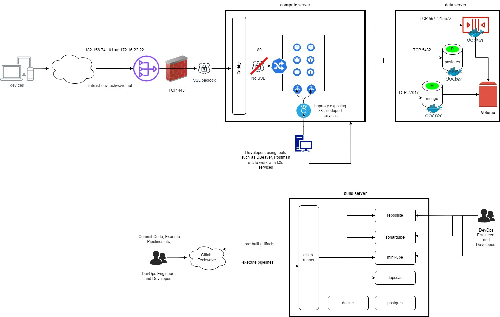

# Overview

This page presents an overview of our development environment.

## Infrastructure

Following on-premise infrastructure is available in DEV environment

## Build Server

The build server is responsible for executing CI/CD pipelines and also housing development tools such as Reposilite, SonarQube etc.

Aspect   | Remarks
---------|-------------------
hostname | TWDSDL-0973
OS       | Ubuntu 22.04.2 LTS
IPAddress| 172.16.8.234
CPU      | 12 CPU
RAM      | 32 GB
	 
## Compute Server

The compute server hosts all our application components

Aspect   | Remarks
---------|-------------------
hostname | TWDSDL-1002
OS       | Ubuntu 20.04.2 LTS
IPAddress| 172.16.22.22
CPU      | 12 CPU
RAM      | 32 GB

	 
## Data Server

The data server hosts all our data

Aspect   | Remarks
---------|-------------------
hostname | twinh-des-0977
OS       | Ubuntu 20.04.6 LTS
IPAddress| 172.16.22.16
CPU      | 12 CPU
RAM      | 16 GB

## Topology

This section describes the topology of the Compute,Data and Build Servers.

We are storing the source code, configuration files, deployment manifests along with helm chart in techwave hosted gitlab (https://gitlabnew.techwave.net)

Developers/Devops engineers commits the code/configuration into the gitlab source code repositories.

After code commit, the pipelines triggers the series of actions describe in .gitlab-ci.yml which is stoed in every module repository.

Gitlab-runner (Agent for Gitlab) which is running in the build server take care of below actions.

1.Code fetch from respective repository to the gitlab-runner workspace.
2.Builds the code using the maven and pushes the executable (.jar file) into the reposilite which is hosted on the same server.
3.Code analysis and reports generation using SonarQube which is runing on the same server on port 9000.
4.Developers can check the generate reports from SonarQube for further analysis.
5.Next, depscan (hosted in docker container) scans the code for the vulnerabilities and generates a detailed report about the severity of vulnerabilities and actions need to be performed to mitigate.
6.Developers/Devops can download the depscan report from Gitlab CI/CD pipleine artifacts.
7.Docker images are built using the Dockerfile stored in the respective repository.
8.Then docker image is pushed into the Gitlab Container Registry
9.To perform the automation testing, an automation environment is provisioned on-demand, and after the tessting, it will be destroyed.
10.Testers/Devops can view the summary of automation testcases report via CI/CD pipeline artifacts
11.A deployment repository (af-devops) takes care of automation testing, deployments in development & staging environment respectively. The pipeline will take care of the following things.
    1.Packages the application helm charts and pushes to Gitlab package registry.
    2.Installs the automation environment in minikube using the application helm charts.
    3.Runs the testcases on automation environment, and generates the summary of testcases.
    4.Destroys the automation environment, after automation testing.
    5.Deploys application in compute server (development environment) on minikube.
    6.Runs smoke tests in compute server (development environment).
    7.Deploys the application in staging environment in EKS cluster which is in AWS cloud.
12.Databases like Postgres, Mongo and message broker RabbitMQ are hosted in Data server as docker containers.
13.Application running on the compute server (development environment) connects to the databases, message broker running on data server. Docker volumes are on the same dataserver for these data & message broker containers.
14.Application is divided into parts:
    1.Allfunds
    2.Accounting
15.Nginx-ingress-controller is in place to route the traffic to application ( Allfunds )
16.When request comes from the internet to the application url "https://fintrust-dev.techwave.net", it resolves to 182.156.74.101 which is the public IP of NAT Gateway.
17.NAT GW then nats the address to 172.16.22.22 which is IP address of the compute server.
18.SSL termination happens at Caddy which have built in feature called letsencrypt, which takes care of certificates and their auto renewal.
19.From caddy, it goes to ingress which has path based routing to the modules running on minikube.
20.Accounting modules aren't exposed outside, allfunds modules communicates with accounting modules using the k8s service names whenever necessary.
21.Accounting modules are exposed via Kubernetes Nodeport service.
22.HAPROXY routes are configured on these nodeports of accounting modules in haproxy configuration file.
23.Developers/QA are using these tunnels to access/test the accounting APIs whenever necessary.
24.For application logging, Openobserve tool is configured on compute server.
25.Light-weight logging agent, fluent-bit collects the logs from application pods and redirects those to openobserve which we can view in UI. 

